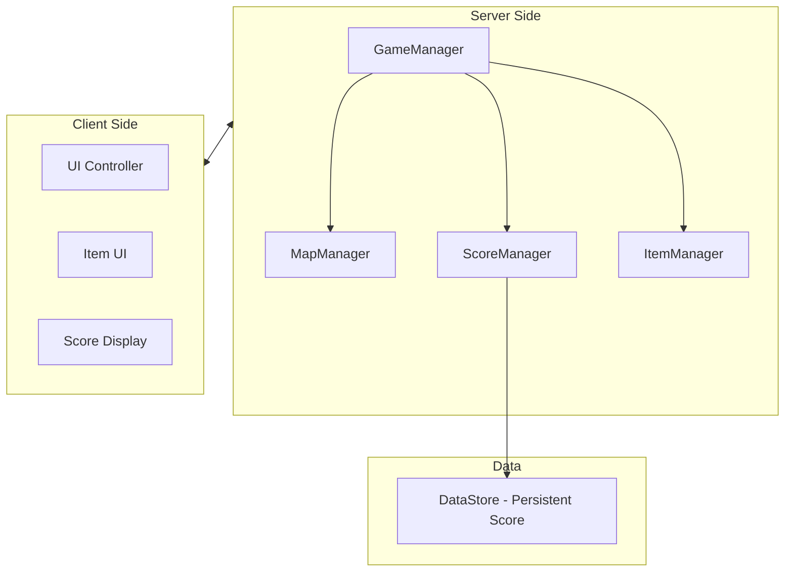

# Roblox Obby Game Plan

## Architecture Overview



## File Structure

```
src/
├── server/
│   ├── init.server.luau          -- Main server entry
│   ├── GameManager.luau          -- Game state management
│   ├── MapManager.luau           -- Random map generation
│   ├── ScoreManager.luau         -- Score handling + DataStore
│   └── ItemManager.luau          -- Push item logic
├── client/
│   ├── init.client.luau          -- Main client entry
│   └── UI/
│       ├── MainUI.luau           -- Main UI controller
│       ├── ItemUI.luau           -- Item button UI
│       └── ScoreUI.luau          -- Scoreboard display
└── shared/
    ├── Config.luau               -- Game configuration
    └── Types.luau                -- Type definitions
```

## Implementation Details

### 1. Lobby System

- สร้าง Lobby zone ใน Workspace โดยมี SpawnLocation สำหรับผู้เล่นใหม่
- มี Teleporter/Button สำหรับเริ่มเล่น Obby
- Lobby จะมี Leaderboard แสดงคะแนนสูงสุด

### 2. Random Map System (MapManager)

- สร้าง 5 Stage Templates เก็บไว้ใน ReplicatedStorage/StageTemplates
- แต่ละ Stage มีขนาดและความยากต่างกัน:
  - Stage 1: Jump platforms (ง่าย)
  - Stage 2: Moving platforms
  - Stage 3: Spinning obstacles
  - Stage 4: Disappearing platforms
  - Stage 5: Combination (ยาก)
- เมื่อเริ่มเกม สุ่มลำดับ 5 stages และวาง Clone ต่อกันเป็นเส้นตรง
- แต่ละ Stage มี Checkpoint ตรงจุดเริ่มต้น

### 3. Push Item System (ItemManager)

- ผู้เล่นเริ่มต้นมี Push item 1 ชิ้น (สามารถเก็บเพิ่มได้ระหว่างทาง)
- เมื่อใช้ Push:
  - Raycast หาผู้เล่นในระยะ 15 studs ข้างหน้า
  - Apply Velocity/BodyForce ผลักเป้าหมายไปด้านหลัง
  - Cooldown 10 วินาที
- มี Item Pickup อยู่กระจายใน Map

### 4. Score System (ScoreManager)

**Round Score:**

- +10 คะแนนเมื่อผ่านแต่ละด่าน (Checkpoint Touch)
- +50 คะแนน Bonus เมื่อเข้าเส้นชัย
- Reset เมื่อเริ่มรอบใหม่

**Persistent Score:**

- ใช้ DataStore เก็บ Total Score และ High Score
- Update เมื่อจบรอบ
- แสดงบน Leaderboard ใน Lobby

### 5. UI System

- **ItemUI**: แสดงจำนวน Push item + ปุ่มใช้งาน (หรือกด E)
- **ScoreUI**: แสดงคะแนนรอบปัจจุบัน + ด่านที่ผ่าน
- **Leaderboard**: แสดง Top 10 คะแนนสูงสุด

## RemoteEvents Required

| Event Name | Direction | Purpose |

|------------|-----------|---------|

| UseItem | Client -> Server | เมื่อผู้เล่นใช้ Push |

| UpdateScore | Server -> Client | อัพเดทคะแนนบน UI |

| StageComplete | Server -> Client | แจ้งว่าผ่านด่าน |

| StartGame | Client -> Server | เริ่มเล่นจาก Lobby |

## Stage Template Structure

แต่ละ Stage Template จะเป็น Model ที่มี:

- `StartPart` - จุดเริ่มต้น (สำหรับวางต่อกัน)
- `EndPart` - จุดสิ้นสุด (สำหรับต่อกับ Stage ถัดไป)
- `Checkpoint` - จุด Spawn เมื่อตาย
- `Obstacles` - Folder เก็บ obstacle ทั้งหมด
- `ItemPickups` - Folder เก็บ item ที่เก็บได้