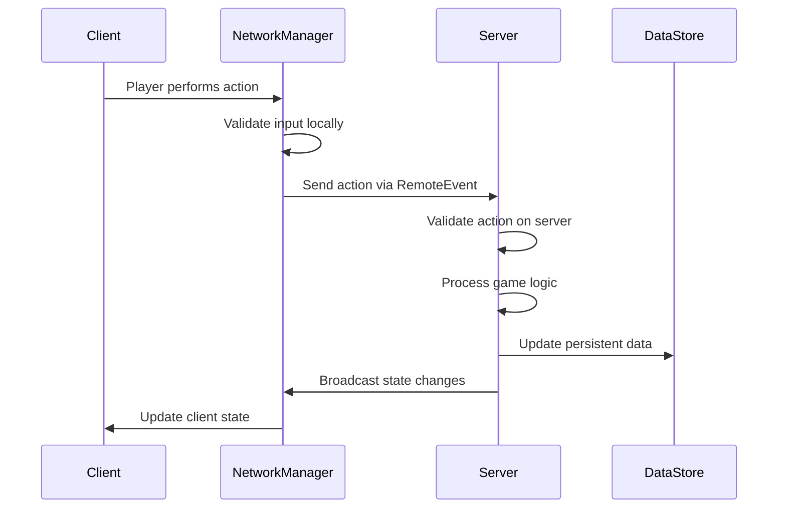
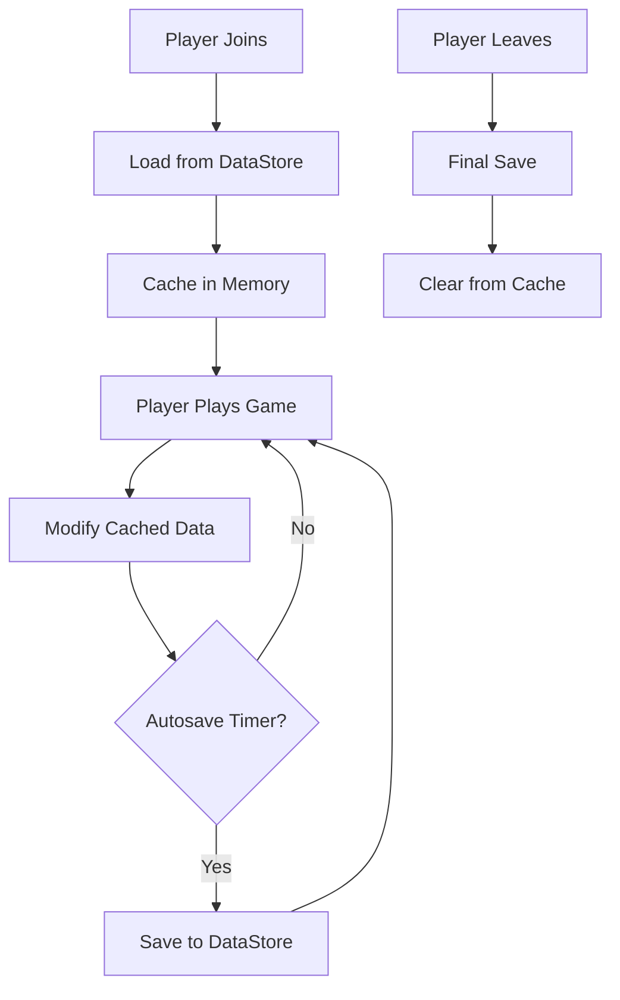

# Technical Specification Template

**Project:** [Project Name]  
**Version:** 1.0  
**Date:** [Current Date]  
**Author:** [Technical Lead]

---

## 🏗️ Architecture Overview

### High-Level Architecture
```
┌─────────────────┐    ┌─────────────────┐    ┌─────────────────┐
│   Client Side   │    │   Roblox Cloud  │    │   External APIs │
│                 │    │                 │    │                 │
│ ┌─────────────┐ │    │ ┌─────────────┐ │    │ ┌─────────────┐ │
│ │ StarterGui  │ │    │ │ServerScript │ │    │ │ HTTP Service│ │
│ │             │ │◄──►│ │  Service    │ │◄──►│ │             │ │
│ │ LocalScripts│ │    │ │             │ │    │ │ Third-party │ │
│ └─────────────┘ │    │ └─────────────┘ │    │ │   Services  │ │
│                 │    │                 │    │ └─────────────┘ │
│ ┌─────────────┐ │    │ ┌─────────────┐ │    └─────────────────┘
│ │Replicated   │ │    │ │ DataStore   │ │
│ │Storage      │ │◄──►│ │  Service    │ │
│ │             │ │    │ │             │ │
│ └─────────────┘ │    │ └─────────────┘ │
└─────────────────┘    └─────────────────┘
```

### Service Layer Architecture
```
┌────────────────────────────────────────────┐
│                Client Layer                │
├────────────────────────────────────────────┤
│           Communication Layer              │
│  (RemoteEvents, RemoteFunctions)           │
├────────────────────────────────────────────┤
│              Business Logic                │
│        (Game Systems, Managers)            │
├────────────────────────────────────────────┤
│             Data Access Layer              │
│      (DataStore, Cache, External APIs)     │
├────────────────────────────────────────────┤
│           Infrastructure Layer             │
│        (Roblox Services, Utilities)        │
└────────────────────────────────────────────┘
```

---

## 📦 System Components

### Client-Side Components

#### UI System
```lua
-- Location: StarterGui/UI/
-- Purpose: Handle all user interface interactions
-- Dependencies: TweenService, UserInputService

UIManager = {
    screens = {},
    currentScreen = nil,
    theme = "dark",
    
    -- Core methods
    showScreen(screenName),
    hideScreen(screenName), 
    toggleScreen(screenName),
    updateTheme(themeName)
}
```

#### Input Controller
```lua
-- Location: StarterGui/Controllers/InputController
-- Purpose: Centralized input handling and mapping
-- Dependencies: UserInputService, ContextActionService

InputController = {
    bindings = {},
    enabled = true,
    
    -- Core methods
    bindAction(actionName, callback, keyCode),
    unbindAction(actionName),
    setEnabled(enabled)
}
```

#### Local Game Logic
```lua
-- Location: StarterGui/LocalScripts/GameLogic
-- Purpose: Client-side game state and prediction
-- Dependencies: RemoteEvents, RunService

LocalGameLogic = {
    gameState = "menu",
    playerState = {},
    predictions = {},
    
    -- Core methods
    updateGameState(newState),
    predictAction(action, data),
    reconcileWithServer(serverState)
}
```

### Server-Side Components

#### Game Manager
```lua
-- Location: ServerScriptService/GameManager
-- Purpose: Core game state and lifecycle management
-- Dependencies: Players, RunService, DataManager

GameManager = {
    state = "waiting",
    players = {},
    gameConfig = {},
    round = {
        startTime = 0,
        duration = 300,
        endConditions = {}
    },
    
    -- Core methods
    initialize(),
    startGame(),
    endGame(),
    updateGameLoop(),
    handlePlayerAction(player, action)
}
```

#### Data Manager
```lua
-- Location: ServerScriptService/DataManager
-- Purpose: Player data persistence and caching
-- Dependencies: DataStoreService, Players

DataManager = {
    cache = {},
    dataStore = nil,
    autosaveInterval = 30,
    
    -- Core methods
    loadPlayerData(player),
    savePlayerData(player),
    updatePlayerData(player, path, value),
    validateData(data)
}
```

#### Security Manager
```lua
-- Location: ServerScriptService/Security/SecurityManager
-- Purpose: Anti-cheat and validation
-- Dependencies: Players, RunService

SecurityManager = {
    playerMetrics = {},
    rateLimits = {},
    suspiciousActions = {},
    
    -- Core methods
    validateAction(player, action, data),
    checkRateLimit(player, actionType),
    flagSuspiciousActivity(player, reason),
    banPlayer(player, duration, reason)
}
```

### Shared Components

#### Network Manager
```lua
-- Location: ReplicatedStorage/Modules/NetworkManager
-- Purpose: Remote event/function management with security
-- Dependencies: RemoteEvent, RemoteFunction

NetworkManager = {
    remotes = {},
    rateLimits = {},
    
    -- Core methods
    createRemoteEvent(name, rateLimit),
    createRemoteFunction(name, rateLimit),
    fireClient(player, eventName, data),
    fireAllClients(eventName, data)
}
```

#### Utility Modules
```lua
-- Location: ReplicatedStorage/Modules/Utils/
-- Purpose: Shared utility functions
-- Dependencies: None

MathUtils = {
    clamp(value, min, max),
    lerp(a, b, t),
    round(value, precision),
    randomRange(min, max)
}

TableUtils = {
    deepCopy(table),
    merge(table1, table2),
    contains(table, value),
    removeElement(table, element)
}

StringUtils = {
    split(str, delimiter),
    trim(str),
    capitalize(str),
    formatTime(seconds)
}
```

---

## 🔄 Data Flow

### Player Action Flow


### Data Persistence Flow


---

## 🗄️ Database Design

### DataStore Structure
```lua
-- Player Data Schema
PlayerData = {
    version = 2, -- For data migration
    profile = {
        displayName = "PlayerName",
        level = 1,
        experience = 0,
        joinDate = 1634567890,
        lastPlayed = 1634567890,
        playtime = 3600 -- seconds
    },
    currency = {
        coins = 1000,
        gems = 50,
        tokens = 25
    },
    inventory = {
        items = {
            {id = "sword_001", quantity = 1, durability = 100},
            {id = "potion_health", quantity = 5}
        },
        equipment = {
            weapon = "sword_001",
            armor = "armor_001",
            accessory = nil
        }
    },
    settings = {
        musicVolume = 0.7,
        sfxVolume = 1.0,
        graphics = "medium",
        controls = "default"
    },
    achievements = {
        "first_win",
        "level_10",
        "collector"
    },
    statistics = {
        gamesPlayed = 42,
        wins = 15,
        losses = 27,
        killDeathRatio = 1.2,
        bestScore = 9999
    }
}
```

### DataStore Configuration
```lua
DataStoreConfig = {
    -- Primary player data store
    playerData = {
        name = "PlayerData_v2",
        scope = "global",
        retryAttempts = 3,
        retryDelay = 1 -- seconds
    },
    
    -- Global game statistics
    gameStats = {
        name = "GameStatistics",
        scope = "global",
        updateInterval = 300 -- 5 minutes
    },
    
    -- Leaderboards
    leaderboards = {
        name = "Leaderboards_v1",
        scope = "seasonal",
        maxEntries = 100
    }
}
```

---

## 🌐 Network Protocol

### Remote Events Schema
```lua
RemoteEvents = {
    -- Player Actions
    "PlayerAction", -- (actionType: string, data: table)
    "PlayerMovement", -- (position: Vector3, rotation: Vector3)
    "PlayerChat", -- (message: string, channel: string)
    
    -- Game State
    "GameStateUpdate", -- (state: string, data: table)
    "RoundStart", -- (roundData: table)
    "RoundEnd", -- (results: table)
    
    -- UI Updates
    "UpdatePlayerData", -- (playerData: table)
    "ShowNotification", -- (message: string, type: string)
    "UpdateLeaderboard", -- (leaderboardData: table)
    
    -- Economy
    "PurchaseItem", -- (itemId: string, quantity: number)
    "SellItem", -- (itemId: string, quantity: number)
    "TransferCurrency" -- (amount: number, currencyType: string)
}
```

### Remote Functions Schema
```lua
RemoteFunctions = {
    -- Data Requests
    "GetPlayerData", -- () -> playerData: table
    "GetShopItems", -- (category: string) -> items: table
    "GetLeaderboard", -- (type: string) -> leaderboard: table
    
    -- Validation
    "ValidateAction", -- (action: table) -> isValid: boolean
    "CheckPermission", -- (permission: string) -> hasPermission: boolean
    
    -- Transactions
    "ProcessPurchase" -- (purchaseData: table) -> success: boolean, result: table
}
```

### Message Format
```lua
-- Standard message envelope
MessageEnvelope = {
    timestamp = tick(),
    messageId = "uuid-v4",
    messageType = "PlayerAction",
    playerId = 12345,
    data = {
        -- Message-specific data
    },
    checksum = "hash" -- For data integrity
}
```

---

## 🔒 Security Design

### Anti-Cheat Architecture
```lua
AntiCheatSystem = {
    -- Movement validation
    movement = {
        maxSpeed = 16, -- studs/second
        maxJumpHeight = 50, -- studs
        teleportThreshold = 100, -- studs
        validationInterval = 0.1 -- seconds
    },
    
    -- Action validation
    actions = {
        rateLimits = {
            ["attack"] = {maxCalls = 5, window = 1},
            ["purchase"] = {maxCalls = 2, window = 5},
            ["chat"] = {maxCalls = 10, window = 60}
        },
        cooldowns = {
            ["special_ability"] = 30, -- seconds
            ["respawn"] = 5
        }
    },
    
    -- Statistical analysis
    analytics = {
        trackMetrics = true,
        suspicionThreshold = 0.8,
        autobanEnabled = false, -- Manual review recommended
        logSuspiciousActivity = true
    }
}
```

### Data Validation
```lua
ValidationRules = {
    playerData = {
        level = {min = 1, max = 100, type = "number"},
        experience = {min = 0, max = 999999, type = "number"},
        currency = {
            coins = {min = 0, max = 999999999, type = "number"},
            gems = {min = 0, max = 99999, type = "number"}
        },
        inventory = {
            maxItems = 100,
            maxStackSize = 999,
            allowedItems = "whitelist" -- Reference to item database
        }
    }
}
```

---

## ⚡ Performance Specifications

### Performance Targets
```lua
PerformanceTargets = {
    framerate = {
        desktop = {min = 45, target = 60}, -- FPS
        mobile = {min = 20, target = 30},
        console = {min = 25, target = 30}
    },
    
    memory = {
        desktop = {max = 512}, -- MB
        mobile = {max = 256},
        console = {max = 384}
    },
    
    network = {
        bandwidth = {
            upstream = {max = 5}, -- KB/s per player
            downstream = {max = 50}
        },
        latency = {
            target = 100, -- milliseconds
            max = 500
        }
    },
    
    loading = {
        initialLoad = {max = 30}, -- seconds
        assetStreaming = {max = 5}
    }
}
```

### Optimization Strategies
```lua
OptimizationStrategies = {
    rendering = {
        lod = true, -- Level of detail
        culling = true, -- Frustum culling
        batching = true, -- Draw call batching
        textureCompression = "automatic"
    },
    
    scripting = {
        objectPooling = true,
        eventThrottling = true,
        memoryProfiling = true,
        garbageCollection = "manual"
    },
    
    networking = {
        dataCompression = true,
        batchUpdates = true,
        prioritization = true,
        interpolation = true
    }
}
```

---

## 🧪 Testing Strategy

### Test Categories
```lua
TestingFramework = {
    unitTests = {
        coverage = 80, -- minimum percentage
        framework = "TestEZ", -- or custom
        automation = true,
        location = "ReplicatedStorage/Tests/"
    },
    
    integrationTests = {
        gameFlow = true,
        dataConsistency = true,
        networkCommunication = true,
        crossPlatform = true
    },
    
    performanceTests = {
        loadTesting = {maxPlayers = 50},
        stressTesting = {duration = 60}, -- minutes
        memoryLeakDetection = true,
        profilingEnabled = true
    },
    
    securityTests = {
        exploitDetection = true,
        inputValidation = true,
        rateLimit = true,
        dataIntegrity = true
    }
}
```

### Test Automation
```lua
-- Example test structure
TestSuite = {
    name = "DataManager Tests",
    tests = {
        {
            name = "Should load player data successfully",
            setup = function() end,
            test = function()
                local player = createMockPlayer()
                local data = DataManager:LoadPlayerData(player)
                assert(data ~= nil, "Player data should not be nil")
                assert(data.level >= 1, "Level should be at least 1")
            end,
            teardown = function() end
        }
    }
}
```

---

## 🚀 Deployment

### Build Process
```yaml
# Build Pipeline Configuration
build:
  stages:
    - validate
    - test
    - package
    - deploy
    
  validate:
    - syntax_check
    - lint_code
    - check_dependencies
    
  test:
    - unit_tests
    - integration_tests
    - performance_tests
    
  package:
    - optimize_assets
    - compress_scripts
    - generate_manifest
    
  deploy:
    - upload_to_roblox
    - update_game_settings
    - verify_deployment
```

### Environment Configuration
```lua
EnvironmentConfig = {
    development = {
        debug = true,
        logging = "verbose",
        antiCheat = false,
        mockData = true
    },
    
    testing = {
        debug = true,
        logging = "standard",
        antiCheat = true,
        mockData = false
    },
    
    production = {
        debug = false,
        logging = "errors_only",
        antiCheat = true,
        mockData = false
    }
}
```

---

## 📊 Monitoring & Analytics

### Performance Monitoring
```lua
PerformanceMonitoring = {
    metrics = {
        "frame_rate",
        "memory_usage", 
        "network_latency",
        "player_count",
        "error_rate"
    },
    
    alerting = {
        frameRateBelow = 30,
        memoryAbove = 400, -- MB
        errorRateAbove = 0.05, -- 5%
        playerDropAbove = 0.1 -- 10%
    },
    
    dashboard = {
        realTime = true,
        historical = true,
        exportData = true
    }
}
```

### Game Analytics
```lua
GameAnalytics = {
    playerMetrics = {
        "session_length",
        "retention_rate",
        "level_progression",
        "currency_earned",
        "items_purchased"
    },
    
    gameplayMetrics = {
        "rounds_played",
        "win_rate",
        "average_score",
        "popular_features",
        "drop_off_points"
    },
    
    businessMetrics = {
        "revenue_per_user",
        "conversion_rate",
        "lifetime_value",
        "churn_rate"
    }
}
```

---

## 🔧 Maintenance

### Update Strategy
```lua
UpdateStrategy = {
    versioning = {
        scheme = "semantic", -- major.minor.patch
        backwardCompatibility = 2, -- versions
        migrationScripts = true
    },
    
    deployment = {
        schedule = "weekly",
        rollback = true,
        gradualRollout = true,
        maintenanceWindow = false -- Live updates
    },
    
    communication = {
        playerNotification = true,
        developerForum = true,
        socialMedia = true
    }
}
```

### Backup Strategy
```lua
BackupStrategy = {
    playerData = {
        frequency = "daily",
        retention = 30, -- days
        verification = true,
        offsite = true
    },
    
    gameAssets = {
        frequency = "on_change",
        versionControl = "git",
        cloudStorage = true
    },
    
    configuration = {
        frequency = "on_change",
        encrypted = true,
        accessControl = true
    }
}
```

---

## 📚 Documentation Standards

### Code Documentation
- All public functions must have docstrings
- Complex algorithms require inline comments
- API changes must update documentation
- Examples required for utility functions

### System Documentation
- Architecture diagrams for major systems
- Data flow documentation
- Integration guides for new developers
- Troubleshooting guides

### User Documentation
- Player guides and tutorials
- FAQ for common issues
- Feature documentation
- Community guidelines

---

**Document Status:** [Draft/Review/Approved]  
**Next Review:** [Date]  
**Owner:** [Technical Lead]  
**Reviewers:** [List of reviewers]

*This technical specification is a living document that evolves with the project. All changes should be reviewed and approved by the technical team.*