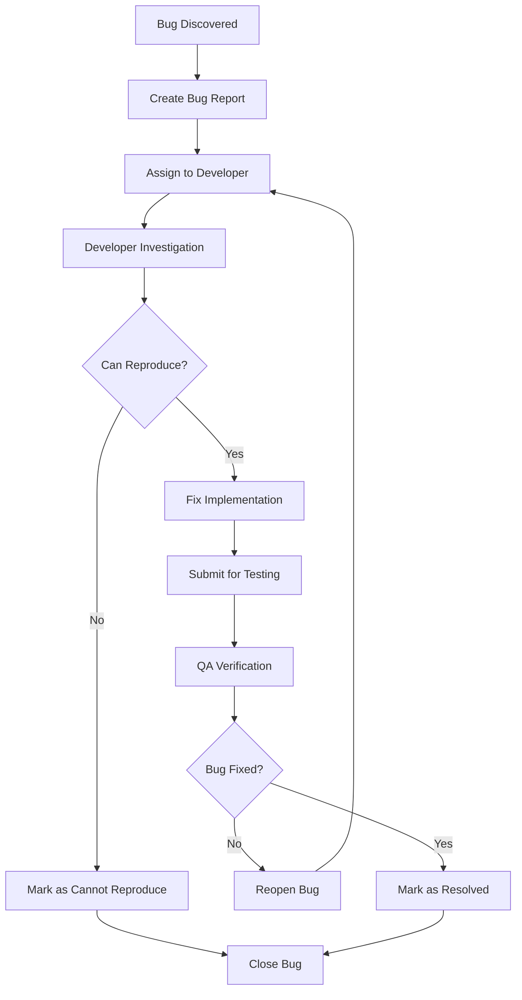

# Testing Plan Template

**Project:** [Project Name]  
**Version:** 1.0  
**Date:** [Current Date]  
**QA Lead:** [Name]  
**Team:** [Testing Team Members]

---

## 🎯 Testing Objectives

### Primary Goals
- Ensure core gameplay mechanics work as designed
- Verify data persistence and player progression
- Validate multiplayer functionality and networking
- Confirm cross-platform compatibility
- Test monetization and economy systems

### Quality Targets
- **Bug Severity 1 (Critical):** 0 bugs in production
- **Bug Severity 2 (High):** <5 bugs in production  
- **Bug Severity 3 (Medium):** <15 bugs in production
- **Performance:** 60 FPS on PC, 30 FPS on mobile
- **Stability:** <1% crash rate across all platforms

### Success Criteria
- All critical and high-severity bugs resolved
- Performance targets met on target devices
- Cross-platform feature parity achieved
- Monetization flows working correctly
- Player data integrity maintained

---

## 📋 Test Scope

### In Scope
✅ **Core Gameplay Features**
- Player movement and controls
- Game mechanics and rules
- Win/loss conditions
- Progression systems

✅ **User Interface**
- Menu navigation
- In-game UI elements
- Settings and configuration
- Mobile touch controls

✅ **Multiplayer Systems**
- Player matchmaking
- Real-time synchronization
- Chat and communication
- Server stability

✅ **Data Management**
- Player data saving/loading
- Currency and inventory systems
- Achievement tracking
- Cross-session persistence

✅ **Monetization**
- Game pass functionality
- Developer products
- Virtual currency purchases
- Premium features

### Out of Scope
❌ **Third-party Integrations** (if not implemented)
❌ **Advanced Analytics** (beyond basic tracking)
❌ **Localization** (unless specified)
❌ **Accessibility Features** (unless required)

---

## 🧪 Testing Types

### 1. Functional Testing

#### Core Gameplay Testing
```yaml
Test Category: Gameplay Mechanics
Priority: Critical
Platform: All

Test Cases:
  - Player Movement:
      - WASD/touch controls respond correctly
      - Jump mechanics work as expected
      - Character collision detection accurate
      - Movement speed within specifications
      
  - Game Rules:
      - Win conditions trigger correctly
      - Lose conditions trigger correctly  
      - Score calculation accurate
      - Timer functions properly
      
  - Power-ups/Items:
      - Items spawn at correct intervals
      - Item effects apply correctly
      - Item duration matches design
      - Items despawn appropriately
```

#### User Interface Testing
```yaml
Test Category: UI/UX
Priority: High
Platform: PC, Mobile, Console

Test Cases:
  - Menu Navigation:
      - All buttons respond to clicks/taps
      - Screen transitions smooth and correct
      - Back navigation works consistently
      - Settings persist between sessions
      
  - In-Game UI:
      - HUD elements display correctly
      - Score/timer updates in real-time
      - Mobile UI scales appropriately
      - Console navigation with gamepad
      
  - Responsive Design:
      - UI adapts to different screen sizes
      - Text remains readable at all scales
      - Touch targets meet minimum size requirements
      - No UI element overlap or clipping
```

### 2. Performance Testing

#### Frame Rate Testing
```yaml
Test Category: Performance - FPS
Priority: Critical
Devices: Low-end mobile, Mid-range PC, High-end PC

Test Scenarios:
  - Idle Game State:
      - Target: 60 FPS (PC), 30 FPS (mobile)
      - Duration: 5 minutes
      - Acceptance: >95% of time at target FPS
      
  - Active Gameplay:
      - Target: 60 FPS (PC), 30 FPS (mobile)  
      - Duration: 15 minutes continuous play
      - Acceptance: >90% of time at target FPS
      
  - Maximum Load:
      - Full server (max players)
      - All effects and particles active
      - Acceptance: >80% of time at minimum FPS
```

#### Memory Testing
```yaml
Test Category: Performance - Memory
Priority: High
Duration: 2 hours continuous play

Test Metrics:
  - Initial Memory Usage: <200MB (mobile), <400MB (PC)
  - Memory Growth: <5MB per hour
  - Memory Leaks: None detected
  - Garbage Collection: Smooth, no frame drops
  
Test Scenarios:
  - Extended Play Session
  - Rapid Scene Transitions  
  - Repeated Game Rounds
  - Asset Loading/Unloading
```

### 3. Multiplayer Testing

#### Network Functionality
```yaml
Test Category: Multiplayer
Priority: Critical
Participants: 2-16 players (depending on game)

Test Cases:
  - Connection Testing:
      - Players can join games consistently
      - Reconnection after network interruption
      - Graceful handling of disconnections
      - Server selection works correctly
      
  - Synchronization:
      - Player actions sync across clients
      - Game state consistent for all players
      - No desynchronization during gameplay
      - Lag compensation working properly
      
  - Communication:
      - Chat messages delivered to all players
      - Voice chat clear and synchronized (if applicable)
      - Player reporting system functional
      - Moderation tools working
```

#### Load Testing
```yaml
Test Category: Server Load
Priority: High
Tools: Multiple client simulation

Test Scenarios:
  - Gradual Load Increase:
      - Start: 1 player
      - Increment: +1 player every 30 seconds
      - Target: Maximum server capacity
      - Monitor: Performance degradation points
      
  - Stress Testing:
      - Players: 150% of maximum capacity
      - Duration: 30 minutes
      - Objective: Verify graceful degradation
      
  - Spike Testing:
      - Rapid influx of players
      - Simulate viral growth scenario
      - Verify auto-scaling if implemented
```

### 4. Security Testing

#### Anti-Cheat Testing
```yaml
Test Category: Security
Priority: Critical
Methods: Simulated exploits, automated testing

Test Scenarios:
  - Speed Hacking:
      - Attempt to modify movement speed
      - Verify server-side validation
      - Confirm automatic detection
      - Test penalty system
      
  - Data Manipulation:
      - Attempt to modify currency values
      - Try to duplicate items
      - Test inventory manipulation
      - Verify server authority
      
  - Network Exploitation:
      - Packet manipulation attempts
      - Rate limit testing
      - Remote event flooding
      - Input validation bypass attempts
```

### 5. Cross-Platform Testing

#### Platform Compatibility
```yaml
Test Matrix:
  Platforms: [Windows PC, Mac, Android, iOS, Xbox]
  Browsers: [Roblox App, Roblox Website]
  
Test Categories:
  - Core Functionality:
      - Game launches successfully
      - All features work as expected
      - Performance meets targets
      - No platform-specific bugs
      
  - Input Methods:
      - Keyboard/Mouse (PC/Mac)
      - Touch controls (Mobile)
      - Gamepad (Console/PC)
      - Voice commands (if applicable)
      
  - Platform Features:
      - Platform-specific achievements
      - Social integration
      - Platform store integration
      - Cloud save synchronization
```

---

## 📱 Device Testing Matrix

### Minimum Requirements
| Device Type | OS | RAM | Storage | Network |
|-------------|----|----|---------|---------|
| PC | Windows 10/macOS 10.14 | 4GB | 1GB | Broadband |
| Mobile | Android 5.0/iOS 10 | 2GB | 500MB | 3G/WiFi |
| Console | Xbox One/PS4 | 8GB | 2GB | Broadband |

### Test Devices
```yaml
PC Testing:
  - Low-end: Intel i3, 4GB RAM, Integrated Graphics
  - Mid-range: Intel i5, 8GB RAM, GTX 1060
  - High-end: Intel i7, 16GB RAM, RTX 3070
  
Mobile Testing:
  - Android: Samsung Galaxy A10, Pixel 4, Samsung S21
  - iOS: iPhone 7, iPhone 11, iPhone 13 Pro
  - Tablets: iPad Air, Samsung Galaxy Tab
  
Console Testing:
  - Xbox: Xbox One, Xbox Series S, Xbox Series X
  - PlayStation: PS4, PS5 (if supported)
```

---

## 🔄 Testing Process

### Test Phases

#### Phase 1: Unit Testing (Developer-led)
```yaml
Duration: Ongoing during development
Responsibility: Developers
Scope: Individual functions and modules

Activities:
  - Automated unit tests
  - Code coverage analysis  
  - Integration testing
  - Performance profiling
```

#### Phase 2: Feature Testing (QA-led)
```yaml
Duration: 2 weeks per major feature
Responsibility: QA Team
Scope: Complete features and user flows

Activities:
  - Manual feature testing
  - Cross-platform verification
  - Performance validation
  - Security testing
```

#### Phase 3: System Testing (QA-led)
```yaml
Duration: 3 weeks
Responsibility: Full QA Team
Scope: Complete game experience

Activities:
  - End-to-end testing
  - Multiplayer testing
  - Load testing
  - Compatibility testing
```

#### Phase 4: User Acceptance Testing
```yaml
Duration: 1 week
Responsibility: Stakeholders + Beta testers
Scope: Complete user experience

Activities:
  - Gameplay validation
  - User experience testing
  - Final bug verification
  - Performance sign-off
```

### Bug Lifecycle


---

## 📊 Test Cases

### Critical Test Cases

#### TC-001: Player Login and Data Loading
```yaml
Test Case ID: TC-001
Priority: Critical
Category: Data Management

Description: Verify player can log in and data loads correctly

Preconditions:
  - Player has existing save data
  - Game is launched and connected to internet

Test Steps:
  1. Launch game application
  2. Click "Play" button
  3. Wait for loading screen to complete
  4. Verify player data displays correctly

Expected Results:
  - Player name displays correctly
  - Level and experience show correct values
  - Inventory items load properly
  - Currency amounts are accurate
  - Settings are applied correctly

Pass Criteria:
  - All player data loads within 10 seconds
  - No data corruption or loss
  - UI displays all information correctly
```

#### TC-002: Multiplayer Game Join
```yaml
Test Case ID: TC-002
Priority: Critical
Category: Multiplayer

Description: Verify player can join multiplayer game successfully

Preconditions:
  - Player is logged in
  - Internet connection stable
  - Available game servers exist

Test Steps:
  1. Click "Play" or "Join Game"
  2. Wait for matchmaking
  3. Observe loading into game
  4. Verify all players visible
  5. Test basic interactions

Expected Results:
  - Matchmaking completes within 30 seconds
  - Player loads into game successfully
  - Other players visible and interactive
  - Game state synchronized for all players
  - Chat/communication functional

Pass Criteria:
  - 95% success rate for joining games
  - No synchronization issues
  - Stable connection maintained
```

#### TC-003: Purchase Transaction
```yaml
Test Case ID: TC-003
Priority: Critical  
Category: Monetization

Description: Verify game pass purchase works correctly

Preconditions:
  - Player logged in with sufficient Robux
  - Game pass available for purchase
  - Payment system functional

Test Steps:
  1. Navigate to store/shop
  2. Select game pass to purchase
  3. Click "Buy" button
  4. Complete Roblox purchase flow
  5. Return to game
  6. Verify purchase benefits applied

Expected Results:
  - Purchase flow completes successfully
  - Robux deducted from player account
  - Game pass benefits immediately available
  - Purchase recorded in player data
  - Confirmation message displayed

Pass Criteria:
  - 100% transaction accuracy
  - No duplicate charges
  - Benefits apply immediately
```

### Performance Test Cases

#### TC-P001: Frame Rate Under Load
```yaml
Test Case ID: TC-P001
Priority: High
Category: Performance

Description: Verify frame rate maintains target under maximum load

Test Setup:
  - Device: Target minimum specifications
  - Scenario: Maximum players in game
  - Duration: 15 minutes continuous

Test Steps:
  1. Join game with maximum players
  2. Engage in active gameplay
  3. Monitor frame rate continuously
  4. Record any drops below target
  5. Note any performance degradation

Success Criteria:
  - PC: >90% of time at 60+ FPS
  - Mobile: >90% of time at 30+ FPS
  - No frame rate drops below 20 FPS
  - Smooth gameplay experience maintained
```

---

## 🐛 Bug Reporting

### Bug Report Template
```markdown
**Bug ID:** [Auto-generated]
**Date:** [Date reported]
**Reporter:** [Name]
**Severity:** [Critical/High/Medium/Low]
**Priority:** [P1/P2/P3/P4]

**Summary:** [Brief description of the issue]

**Environment:**
- Platform: [PC/Mobile/Console]
- OS Version: [Specific version]
- Game Version: [Version number]
- Device: [Specific device if mobile/console]

**Steps to Reproduce:**
1. [First step]
2. [Second step]
3. [Continue...]

**Expected Result:** [What should happen]
**Actual Result:** [What actually happens]

**Additional Information:**
- Screenshot/Video: [Attached files]
- Frequency: [Always/Sometimes/Rarely]
- Workaround: [If any exists]
- Related bugs: [References to similar issues]

**Developer Notes:** [For developer use]
```

### Severity Definitions
```yaml
Critical (P1):
  - Game crashes or becomes unplayable
  - Data loss or corruption
  - Security vulnerabilities
  - Payment system failures
  
High (P2):
  - Major features not working
  - Significant performance issues
  - Multiplayer connectivity problems
  - UI blocking progression

Medium (P3):
  - Minor feature malfunctions
  - Cosmetic UI issues
  - Slight performance degradation
  - Non-critical error messages

Low (P4):
  - Spelling/grammar errors
  - Minor visual glitches
  - Enhancement requests
  - Documentation updates
```

---

## 📈 Test Metrics

### Quality Metrics
```yaml
Bug Metrics:
  - Bugs per feature
  - Bug find rate (bugs found per testing hour)
  - Bug fix rate (bugs fixed per day)
  - Reopened bug percentage
  - Bug severity distribution

Coverage Metrics:
  - Feature coverage percentage
  - Platform coverage percentage
  - Test case execution rate
  - Code coverage (for unit tests)

Performance Metrics:
  - Average frame rate by platform
  - Memory usage trends
  - Load time measurements
  - Network latency statistics
```

### Reporting Schedule
- **Daily:** Bug counts and severity breakdown
- **Weekly:** Test progress and coverage metrics
- **Milestone:** Complete test summary and quality assessment
- **Release:** Final test report with sign-off recommendations

---

## ✅ Test Sign-off Criteria

### Pre-Release Checklist
- [ ] All P1 (Critical) bugs resolved
- [ ] All P2 (High) bugs resolved or approved for release
- [ ] Performance targets met on all platforms
- [ ] Security testing passed
- [ ] Multiplayer functionality stable
- [ ] Monetization systems working correctly
- [ ] Cross-platform compatibility verified
- [ ] Final user acceptance testing completed
- [ ] Documentation updated
- [ ] Release notes prepared

### Release Approval
**QA Lead Sign-off:** _________________ Date: _______  
**Technical Lead Sign-off:** _________________ Date: _______  
**Product Manager Sign-off:** _________________ Date: _______  
**Project Manager Sign-off:** _________________ Date: _______  

---

## 📚 Test Resources

### Testing Tools
- **Roblox Studio:** Built-in testing tools
- **Device Farm:** Mobile device testing
- **Performance Profiler:** Frame rate and memory monitoring
- **Network Simulator:** Latency and packet loss testing
- **Bug Tracking:** [Jira/Trello/GitHub Issues]

### Documentation
- [Test Case Repository]
- [Bug Report Database]  
- [Performance Benchmarks]
- [Testing Guidelines]
- [Device Specifications]

### Training Materials
- Testing methodology guidelines
- Platform-specific testing procedures
- Bug reporting best practices
- Performance testing protocols

---

**Document Version:** 1.0  
**Last Updated:** [Date]  
**Next Review:** [Date]  
**Approved By:** [QA Lead Name]

*This testing plan should be reviewed and updated regularly to reflect changes in game features, platforms, and testing procedures.*